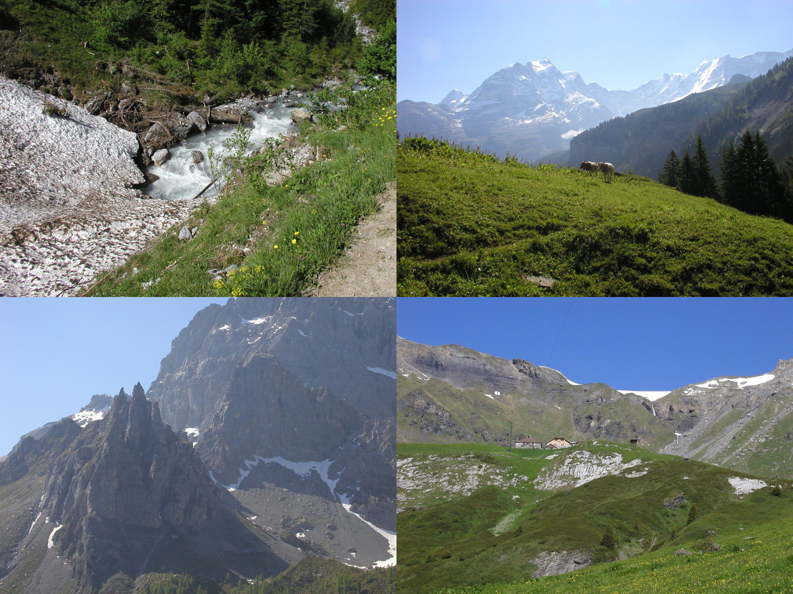
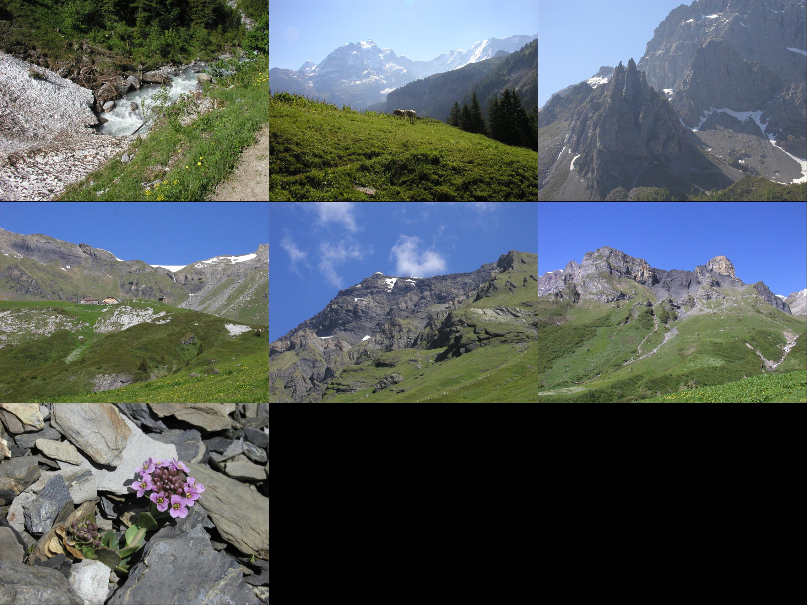

============
contactsheet
============

.. image:: https://img.shields.io/pypi/v/contactsheet.svg
        :target: https://pypi.python.org/pypi/contactsheet

.. image:: https://img.shields.io/travis/paul-butcher/contactsheet.svg
        :target: https://travis-ci.org/paul-butcher/contactsheet

.. image:: https://readthedocs.org/projects/contactsheet/badge/?version=latest
        :target: https://contactsheet.readthedocs.io/en/latest/?badge=latest
        :alt: Documentation Status

Contactsheet compiles a set of images into a single contact sheet image.

* Free software: MIT license
* Documentation: https://contactsheet.readthedocs.io.

Features
--------

Produces a contact sheet of images.

The output contact sheet image is roughly the same size as the first original image provided.

A contactsheet image made of a square number will be a square grid.
e.g.  4 images is a 2x2 grid of thumbnails.

.. code-block:: shell

    $ ls -1 sampledata/p101016*
    sampledata/p1010161.jpg
    sampledata/p1010167.jpg
    sampledata/p1010168.jpg
    sampledata/p1010169.jpg

    $ ls -1 sampledata/p101016* | contactsheet

A contactsheet image made of a non-square number will be as close
to square as possible.

.. code-block:: shell

    $ ls -1 sampledata/p10101*
    sampledata/p1010161.jpg
    sampledata/p1010167.jpg
    sampledata/p1010168.jpg
    sampledata/p1010169.jpg
    sampledata/p1010170.jpg
    sampledata/p1010173.jpg
    sampledata/p1010178.jpg
    $ ls -1 sampledata/p10101* | contactsheet

Credits
-------

This package was created with Cookiecutter_ and the `audreyr/cookiecutter-pypackage`_ project template.

.. _Cookiecutter: https://github.com/audreyr/cookiecutter
.. _`audreyr/cookiecutter-pypackage`: https://github.com/audreyr/cookiecutter-pypackage
